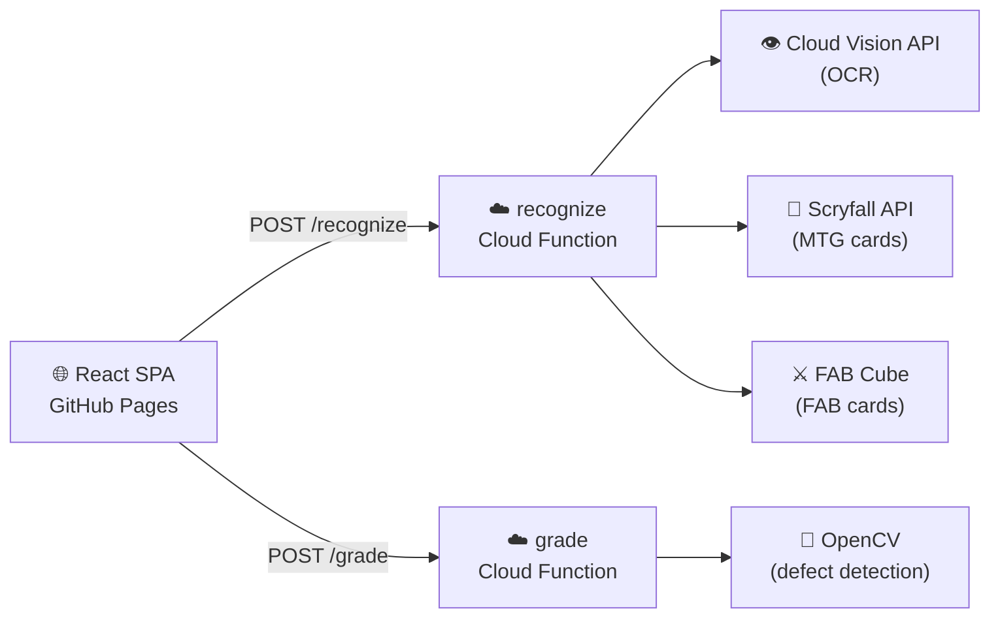

<div align="center">

# 🃏 Card Grading

**AI-powered card identification and grading for MTG and Flesh & Blood**

[](https://github.com/Schiggy-3000/card_grading/actions/workflows/frontend.yml)
[](https://github.com/Schiggy-3000/card_grading/actions/workflows/backend.yml)
[](https://react.dev)
[](https://python.org)
[](LICENSE)

[**Live Demo →**](https://schiggy-3000.github.io/card_grading/)

</div>

---

## What it does

Upload a photo of any **Magic: The Gathering** or **Flesh and Blood** card and get:

| Feature | Description |
|---|---|
| 🔍 **Identify** | Recognizes the card via OCR + AI — returns name, edition, foil status, and price |
| 📊 **Grade** | Analyzes front and back for physical defects — returns a condition score (PSA / BGS / CGC / TAG) |

---

## Architecture



---

## Tech Stack

**Frontend** — React 19 · Vite 8 · React Router (HashRouter) · CSS Modules  
**Backend** — Python 3.12 · Google Cloud Functions (2nd gen) · functions-framework  
**APIs** — Google Cloud Vision · Scryfall · The FAB Cube  
**Testing** — pytest · Playwright (E2E)  
**CI/CD** — GitHub Actions → GitHub Pages + Google Cloud Functions

---

## Getting Started

### Prerequisites

- Node.js 20+
- Python 3.12+
- A Google Cloud project with Cloud Vision API enabled

### 1 — Clone

```bash
git clone https://github.com/Schiggy-3000/card_grading.git
cd card_grading
```

### 2 — Frontend

```bash
cd frontend
npm install
```

Copy the environment file and point it at your local backend:

```bash
cp .env.example .env.local
# .env.local already contains:
# VITE_RECOGNIZE_URL=http://localhost:8081
# VITE_GRADE_URL=http://localhost:8082
```

Start the dev server:

```bash
npm run dev        # http://localhost:5173/card_grading/
```

### 3 — Backend

```bash
pip install -r backend/requirements-dev.txt
pip install -r backend/recognize/requirements.txt
pip install -r backend/grade/requirements.txt
```

Set your GCP credentials:

```bash
export GOOGLE_APPLICATION_CREDENTIALS=".credentials/<your-key>.json"
```

Start both functions in separate terminals:

```bash
# Terminal 1 — identify
functions-framework --target=recognize --port=8081 --source=backend/recognize

# Terminal 2 — grade
functions-framework --target=grade --port=8082 --source=backend/grade
```

---

## Running Tests

**Backend unit tests:**

```bash
PYTHONPATH=backend/recognize pytest backend/recognize/tests/ -v
PYTHONPATH=backend/grade    pytest backend/grade/tests/ -v
```

**Frontend E2E tests (Playwright):**

```bash
cd tests/playwright
pip install -r requirements.txt
playwright install chromium
pytest -v
```

---

## Deployment

Every push to `master` triggers automated deployment:

| Changed path | Workflow | Action |
|---|---|---|
| `backend/**` | `backend.yml` | Run unit tests → deploy to Cloud Functions |
| `frontend/**` | `frontend.yml` | Build with Vite → deploy to GitHub Pages |

### Required GitHub Secrets

| Secret | Description |
|---|---|
| `GCP_SERVICE_ACCOUNT_KEY` | GCP service account JSON (full content) |
| `VITE_RECOGNIZE_URL` | Deployed Cloud Function URL for `/recognize` |
| `VITE_GRADE_URL` | Deployed Cloud Function URL for `/grade` |

---

## Project Structure

```
card_grading/
├── frontend/               # React 19 + Vite SPA
│   ├── src/
│   │   ├── api/            # fetch wrappers (recognize.js, grade.js)
│   │   ├── context/        # AppContext — grading standard + session history
│   │   ├── pages/          # Home, Identify, Grade, History
│   │   └── components/     # ImageUpload, CandidateList, CardDetail, GradeResult, …
│   └── vite.config.js      # base: '/card_grading/' for GitHub Pages
│
├── backend/
│   ├── recognize/          # GCF: OCR → card DB lookup → ranked candidates
│   └── grade/              # GCF: OpenCV defect detection → PSA/BGS/CGC/TAG score
│
├── tests/
│   ├── playwright/         # Frontend E2E (46 tests)
│   └── api_smoke_tests/    # External API smoke tests
│
└── .github/workflows/
    ├── frontend.yml
    └── backend.yml
```

---

## Grading Standards

The grade function supports four industry-standard scales:

| Standard | Publisher | Scale |
|---|---|---|
| **PSA** | Professional Sports Authenticator | 1 – 10 (whole numbers) |
| **BGS** | Beckett Grading Services | 1 – 10 (half points) |
| **CGC** | Certified Guaranty Company | 1 – 10 (half points) |
| **TAG** | Technical Authentication & Grading | 1 – 10 (quarter points) |

Your preferred standard is saved in `localStorage` and applied to every grading session.

---

## Supported Games

| Game | Card database | Pricing |
|---|---|---|
| Magic: The Gathering | [Scryfall](https://scryfall.com) | Scryfall market data |
| Flesh and Blood | [The FAB Cube](https://github.com/the-fab-cube/flesh-and-blood-cards) | fabdb.net |

---

<div align="center">

Built with ☁️ Google Cloud · ⚛️ React · 🐍 Python

</div>
